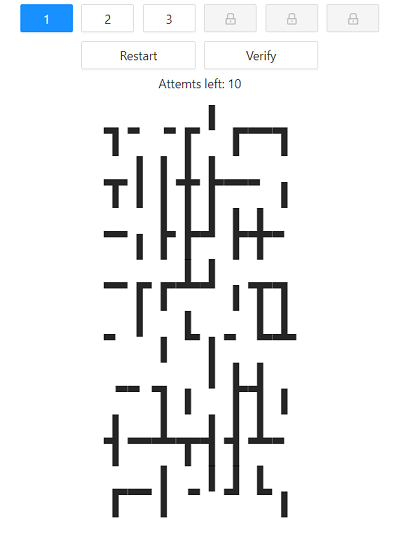

# Pipes game
The goal of the puzzle is to rotate the tiles on the map to make all pipes connected in a single group, with no loops and no dangling pipes. 

You have `only 10` attempts to verify.
### [Play](https://master--venerable-cat-c3d9be.netlify.app/) 



After you complete the level you will receive the password.
First level password:   `JustWarmingUp`

### How to enter locked levels?
To enter locked levels you should complete previous.

### How to run
 1. Clone the repo
 2. Install dependencies
    ```
    npm i
    ```
 3. Run project
    ```
    npm start
    ```
